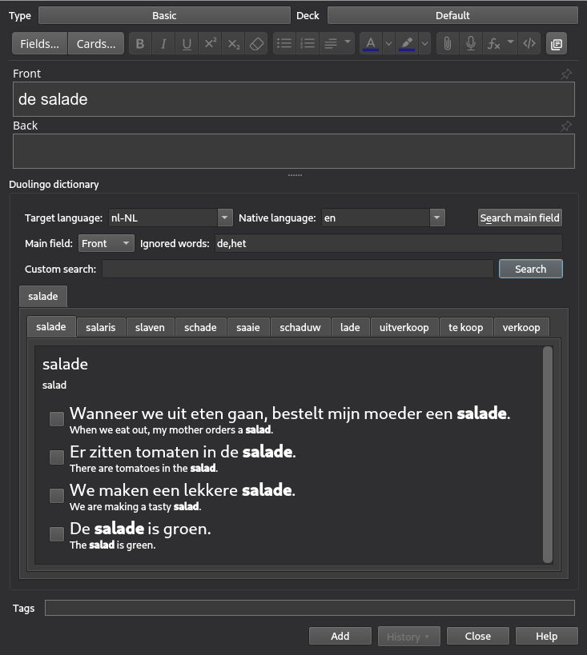

# Duolingo Dictionary Anki add-on
[AnkiWeb](https://github.com/atmatto/anki-duolingo-dictionary)

This addon provides an UI to search for words in the Duolingo dictionary.

You can open the add-on by clicking its icon in the top right corner of the editor window. When you click "Search main field" (or use the keyboard shortcut `alt+e`), the addon will search for the words which are contained in the main field. It will ignore words which are specified in the corresponding field, for example articles, and won't search for them. You can also search for a custom word, by entering it into adequate field and clicking "Search". The addon will present a tabbed window. The upper tabs correspond to the words which were found in the main field, and the lower tabs present the search results. After opening one, you will see a translation of the word and its usage examples from Duolingo dictionary. To the left of the examples there are buttons, which when clicked will paste selected example into the current field of the note.

The addon can be configured. You can choose the default values of settings for different decks. The way in which examples are pasted can be customized as well.

Addon can be used both in the "Add cards" dialog and in the card browser.

This addon is in the beta development phase. It can sometimes be buggy and not all functionality is finished. If you are a programmer and want to help in the development, pull requests are welcome. If you see a bug, please let me know by [opening an issue](https://github.com/atmatto/anki-duolingo-dictionary/issues/new) and describing the problem.
